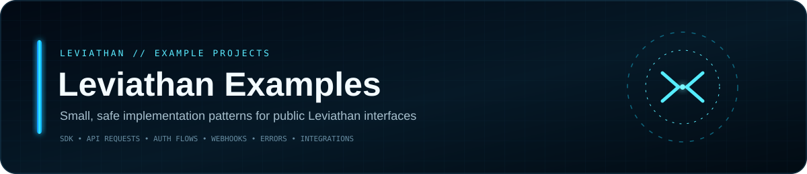
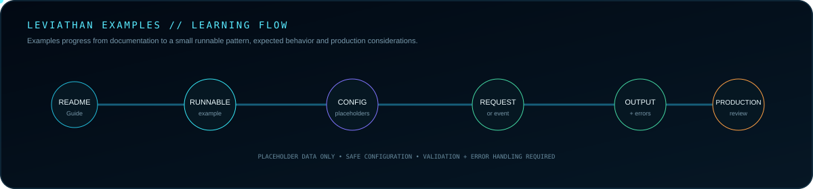
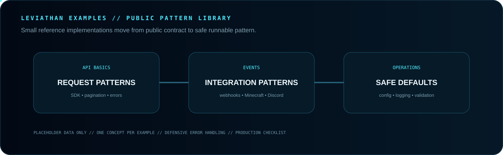

 

**Small implementation patterns for public Leviathan APIs, SDKs, webhooks and integrations.**

[Guide](GUIDE.md) · [API Docs](https://github.com/Lapinite/Leviathan-API-Docs) · [SDK](https://github.com/Lapinite/Leviathan-SDK) · [Integrations](https://github.com/Lapinite/Leviathan-Integrations) · [Security](SECURITY.md)

## Example lifecycle

## Pattern library

## Rules

**Small** · one concept at a time  
**Explicit** · name the public contract  
**Safe** · placeholder data only  
**Defensive** · validate inputs and failures  
**Practical** · state what production use still requires

Third-party platforms remain external dependencies. Examples never imply ownership of or bypasses for their authentication, entitlement, permission or security systems.

Real access tokens, refresh tokens, client secrets, private keys, bot tokens, webhook credentials, database credentials, account details, private endpoints and personal information stay out of this repository.

## Network

[API Docs](https://github.com/Lapinite/Leviathan-API-Docs) · [SDK](https://github.com/Lapinite/Leviathan-SDK) · [Integrations](https://github.com/Lapinite/Leviathan-Integrations) · [Docs](https://github.com/Lapinite/Leviathan-Docs)

## License

Apache License 2.0. See [LICENSE](LICENSE).
